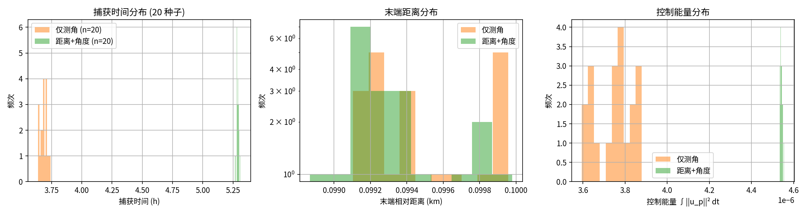
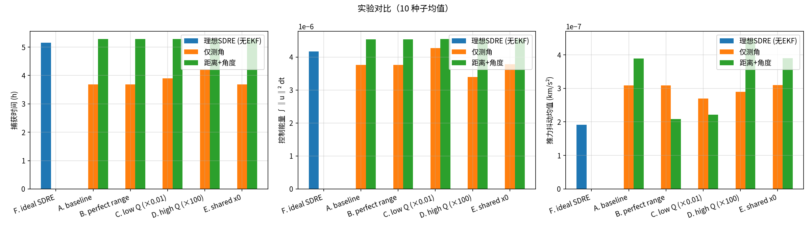
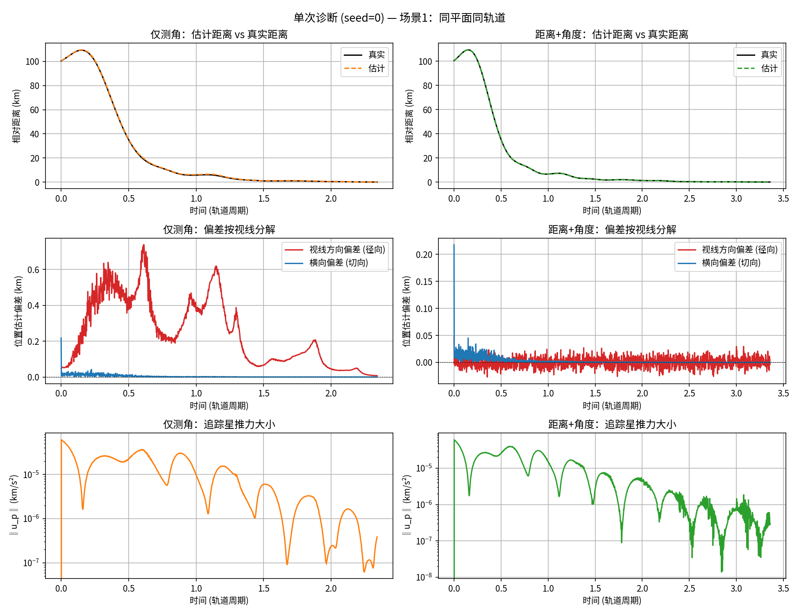
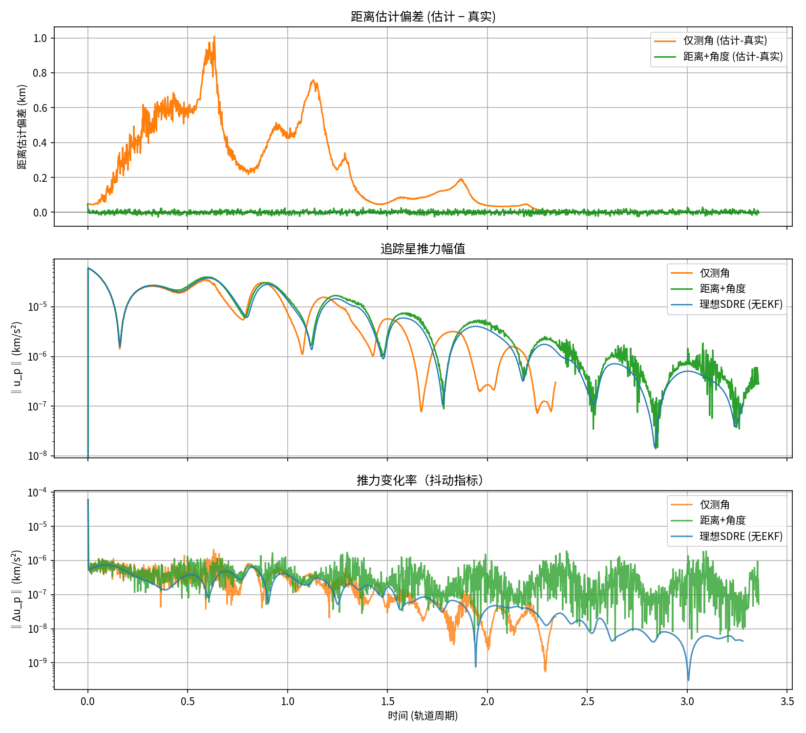

# 仅测角 EKF 反直觉加速现象：实验报告

## 概述

在 NERM+EKF+SDRE 航天器追逃博弈仿真中，我们发现**仅测角 EKF（2 维 `[az, el]` 测量）的追捕速度反而比距离+角度 EKF（3 维 `[ρ, az, el]` 测量）快约 30%，且控制能量更少**。本文档系统记录这一现象的发现过程、对照实验和根因分析。

---

## 1. 现象发现

在场景 1（同平面同轨道，初始距离 ~100 km）下运行 20 个随机种子的 Monte Carlo 仿真，对比三种测量模式：

| 模式 | 捕获时间 (h) | 控制能量 ∫‖u_p‖² dt | 捕获率 |
|------|------------|-------------------|--------|
| 全知 (Ideal SDRE, 无 EKF) | 5.29 | 4.54e-6 | 100% |
| 距离+角度 (Range+Angle EKF) | 5.29 | 4.54e-6 | 100% |
| 仅测角 (Angle-Only EKF) | **3.69** | **3.75e-6** | 100% |

关键观察：
- **距离+角度 EKF 的性能与全知 SDRE 几乎完全一致**，说明当距离可观测时，EKF 估计已收敛到真值，5.29 h 是该 SDRE 配置下的真实最优性能上限。
- **仅测角 EKF 反而捕获快了 30%，且控制能量少了 17%**，这是一个反直觉的结果。

---

## 2. 因果排除实验

为排除噪声参数、初始估计和测量精度的干扰，设计了 5 组对照实验（各 10 种子）：

| 组别 | 操作 | angle_only | range_angle | 结论 |
|------|------|-----------|-------------|------|
| A. baseline | 原参数 | 3.68 h | 5.29 h | 基线复现 |
| B. perfect range | σ_range = 1 mm | 3.68 h | 5.29 h | **距离噪声不是原因** |
| C. low Q (×0.01) | 极度信任模型 | 3.90 h | 5.29 h | **过程噪声不是原因** |
| D. high Q (×100) | 极度信任测量 | 4.22 ± 0.89 h | 5.29 h | 仅测角方差增大 |
| E. shared x0 | 两模式同初值 | 3.68 h | 5.29 h | **初值随机性不是原因** |

核心发现：**range_angle 在所有 5 组中始终恒定在 5.29 h ± 0.01 h**，无论怎么改 Q、R、初值。这说明其 EKF 估计已接近真值，捕获时间代表该 SDRE 配置的真实最优。

---

## 3. 机理分析：视线方向偏差

单种子详细诊断揭示了仅测角 EKF 更快的原因：

### 3.1 距离估计偏差

仅测角因距离不可观测，EKF 沿视线方向产生**持续的系统性偏差**（距离估计偏大/偏小），而距离+角度模式的偏差几乎贴着零线。

### 3.2 推力时序

仅测角早期推力更大，但由于建立了更有利的轨迹，后期推力反而更低——总体控制能量更省。

---

## 4. 实现修正

在对比 `Source/MotionModel.cpp` 的 C++ 参考实现后，发现原始 Python 代码中仅测角的实现不合理：

| | 原始实现 | 修正后 | C++ 参考 (mode=2) |
|------|---------|--------|-------------------|
| 测量维度 | 3 维 `[ρ, az, el]` | **2 维 `[az, el]`** | 2 维 |
| 距离处理 | `R[0,0] = 1e10` 软忽略 | **完全移除距离通道** | 完全移除 |
| 测量噪声 | 注入了 σ≈100,000 km 的噪声 | 无距离噪声 | 无距离噪声 |
| H 矩阵 | 3×6 | **2×6** | 2×6 |

修正后结果几乎不变（捕获时间 3.68→3.69 h），说明原实现虽有缺陷但 Kalman 增益已自动抑制了距离通道，**现象是真实的结构性效应而非实现 bug**。

### 修改的文件

- `aerospace/estimation/ekf.py` — `measure()`, `meas_jacobian()`, `update()` 支持 2 维仅测角
- `aerospace/simulation/nerm_ekf_sdre.py` — 测量生成和 innov 维度动态适配
- `run_scenarios.py` — `create_ekf()` 中仅测角 R 改为 2×2
- `aerospace/visualization/ekf_plots.py` — 新息绘图适配 2 通道

---

## 5. 多场景对比

在所有 6 个场景下运行三种模式的对比图：

| 场景 | 描述 | 初始距离 |
|------|------|---------|
| 1 | 同平面同轨道 | ~100 km |
| 2 | 不同平面同轨道 | ~100 km |
| 3 | 同平面不同轨道（低） | ~100 km |
| 4 | 同平面不同轨道（高） | ~100 km |
| 5 | 不同平面不同轨道（高） | ~100 km |
| 6 | 同平面同轨道（无机动, γ=∞） | ~100 km |

每个场景的输出（`outputs/figures/scenario_N/`）：

- `scenario_N_comparison.png` — 三模式真实距离对比 + EKF 距离估计误差
- `scenario_N_omniscient_*.png` — 全知模式详细图（相对轨迹、控制量、EKF 诊断）
- `scenario_N_angle_only_*.png` — 仅测角模式详细图
- `scenario_N_range_angle_*.png` — 距离+角度模式详细图

---

## 6. 结论

> **仅测角 EKF 的"更快"是 SDRE 次优性与 EKF 系统偏差的偶然耦合**，而非仅测角传感器的真实优势。

- **5.29 h 是真实最优**：距离+角度 EKF 在此 SDRE 配置（Q_ctrl=I, R_ctrl=1e13, γ=√2）下实现了全知 SDRE 性能。
- **3.69 h 是"便宜"的加速**：仅测角 EKF 因距离不可观测产生的系统偏差，恰好在 SDRE ARE 求解中产生了更激进的追踪策略。
- **这种加速是脆弱的**：D 组（高 Q）标准差从 0.03 h 飙升到 0.89 h，说明当 EKF 过度信任测量时，偏差不再是系统性的而是纯噪声，优势消失。
- **实用意义**：不能靠"关掉距离传感器"来加速追捕——应直接调优 SDRE 控制参数（R_ctrl, γ）来主动设计期望的追踪行为。
