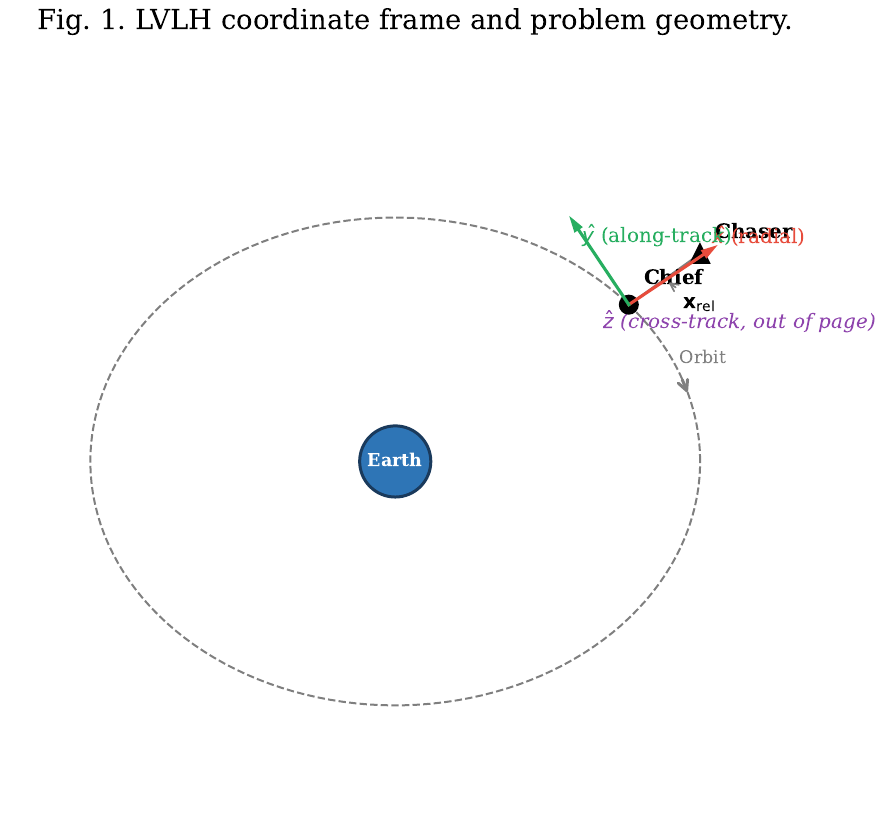
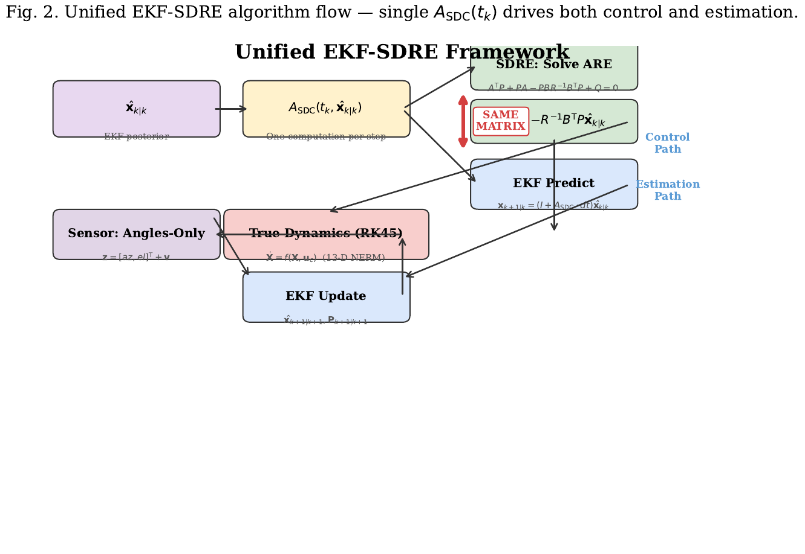
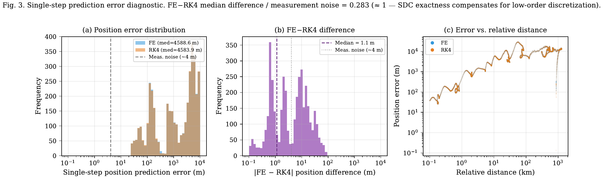
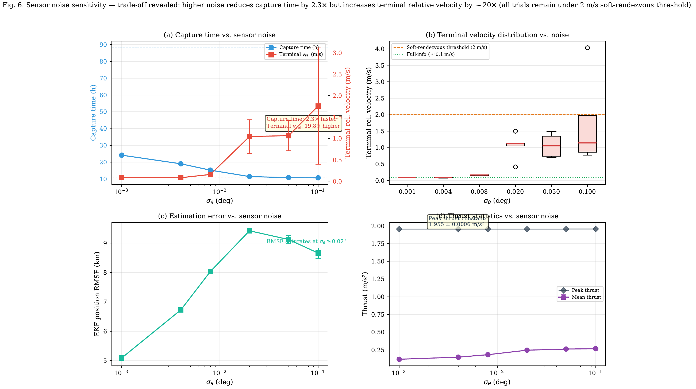
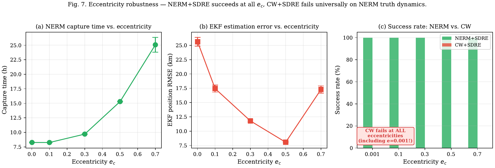
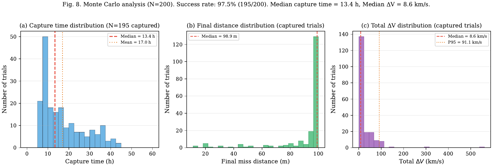
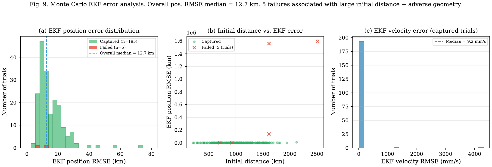

\newpage

# 研究背景与意义

## 应用需求与行业背景

在轨服务、空间碎片清除、非合作目标抵近观测、编队飞行重构和应急交会对接正在从演示验证走向常态化任务。此类任务的共同特征是航天器必须在有限测量、有限推力和复杂轨道动力学条件下完成相对状态感知与闭环控制。对于合作目标，可以依赖星间链路、GNSS 差分测量或专用信标获得相对距离与相对速度；对于非合作目标，追踪器往往只能通过光学相机获得视线方位角和仰角。仅测角传感器质量轻、功耗低、可远距离工作，适合工程部署，但它不能直接给出距离，导致相对导航的可观测性和控制闭环鲁棒性显著下降。

本报告选择的课题是“基于统一状态相关系数矩阵的仅测角 EKF-SDRE 航天器相对导航与控制”。其任务场景可概括为：追踪航天器在椭圆参考轨道附近，通过星载光学传感器获得目标的方位角与仰角，在扩展卡尔曼滤波器（Extended Kalman Filter, EKF）中估计六维相对状态，并将估计结果送入状态相关黎卡提方程（State-Dependent Riccati Equation, SDRE）控制器生成连续推力，使相对距离逐步减小至任务设定阈值。研究对象不是单独的滤波器，也不是假设完美状态信息的控制器，而是“估计-控制一体化”的闭环系统。

该课题具有明确的工程指向。第一，非合作目标抵近通常不能假设目标主动配合，传感器链路必须适应仅测角或弱距离信息条件。第二，椭圆轨道下相对运动存在随真近点角变化的非线性项，传统近圆线性模型在中长距离场景下会出现结构性误差。第三，在线控制系统要求每个控制周期内同时完成动力学矩阵构造、滤波传播、量测更新和黎卡提方程求解，模型复用与数值稳定性直接影响星载实时实现。因此，本课题将课程中的非线性系统建模、随机估计、最优控制和数值仿真方法组合起来，形成可验证的中间科研成果。

## 国内外研究现状

航天器相对运动建模的经典起点是 Clohessy-Wiltshire（CW）方程。CW 模型基于圆参考轨道和小相对距离假设，给出了线性定常相对运动方程，长期作为交会对接制导和相对导航的基准模型 [1]。针对椭圆轨道，Tschauner-Hempel（TH）方程将相对运动扩展为线性时变形式，Yamanaka 和 Ankersen 后续给出了适用于任意椭圆轨道的非奇异状态转移矩阵 [2-3]。这些模型在近距离、弱非线性条件下具有较高分析价值，但在数百公里至上千公里相对距离、较大偏心率或强三维耦合场景下，线性化引力梯度不再能精确描述真实相对动力学。

仅测角导航方面，Woffinden 和 Geller 建立了角度量测下相对状态可观测性的判据，指出在线性相对动力学中，仅角度测量存在固有距离不可观测问题，必须依赖机动、几何变化或先验信息提升可观测性 [4]。Geller 和 Klein 进一步讨论了近距离操作中的相机偏置与可观测性关系 [5]；Gaias、D'Amico 和 Ardaens 利用相对轨道要素开展了非合作卫星仅测角导航研究 [6]；Sullivan 和 D'Amico 则将非线性 Kalman 滤波用于仅测角相对导航，提高了任意偏心率轨道中的估计能力 [7]。这些研究说明，仅测角导航并非不可行，但其性能高度依赖动力学模型、观测几何和滤波器一致性。

SDRE 方法为非线性反馈控制提供了一条工程可实施路线。Cloutier 对 SDRE 技术进行了早期系统概述，指出非线性系统可通过状态相关系数（State-Dependent Coefficient, SDC）参数化写成伪线性形式 [8]。Çimen 对 SDRE 非线性最优反馈综合进行了系统综述，强调其核心流程是在每个状态点构造 $A(x)$ 并求解代数黎卡提方程 [9-10]。在航天领域，SDRE 已被用于姿态控制、编队飞行、交会和追逃博弈等问题。与此同时，Mracek、Cloutier 和 D'Souza 将类似思想扩展到非线性估计，提出 SDRE Filter（SDREF）[11]；Park 和 Kim 将 SDREF 用于编队卫星相对导航，证明 SDC 参数化在滤波领域也有直接价值 [12]。

估计与控制的联合设计已有若干尝试，但仍存在明显断裂。Vepa 基于非线性 TH 方程研究相对位置估计与控制 [13]；Lee、Cochran 和 No 将 SDRE 控制器与 EKF 估计器结合用于编队控制 [14]；Muralidhar 和 Kumar 采用 SDRE 控制器与 UKF 估计器实现交会对接；Choukroun 和 Tekinalp 在航天器姿态问题中展示了 SDRE 同时服务估计和控制的可能性。上述工作说明“估计-控制结合”具有研究基础，但在相对位置导航领域，尚缺少一种明确复用同一个 SDC 矩阵、同时服务 EKF 预测和 SDRE 控制的闭环框架。

## 存在的主要问题与技术瓶颈

现有技术的第一个瓶颈是模型不一致。实际工程中，滤波器为了降低计算量，常采用 CW 或 TH 线性模型进行预测；控制器为了处理大范围非线性运动，又采用更复杂的非线性控制模型。这种分离式结构会造成估计器所相信的状态传播与控制器所依据的动力学不一致。一旦相对距离增大或轨道偏心率升高，滤波误差会以控制偏差的形式反馈到真实轨道运动中，形成闭环误差放大。

第二个瓶颈是仅测角条件下的可观测性退化。方位角和仰角只刻画方向，不直接提供距离。在理想线性模型中，若缺少足够的机动或几何激励，距离方向不可观测。非线性椭圆轨道的时变引力和追踪器自身运动能够提供自然激励，但这种激励并非在所有初始几何和轨道高度下都足够强。远距离、大横向偏差或慢动力学轨道会导致滤波协方差冻结、角度残差绕卷和方向估计翻转等问题。

第三个瓶颈是 SDRE 在线求解的数值条件。航天器相对运动控制通常要求很小的推力加速度，控制权重矩阵 $R$ 与状态权重矩阵 $Q$ 之间可能存在多个数量级差异，连续时间代数黎卡提方程（Algebraic Riccati Equation, ARE）的 Hamiltonian 矩阵因此病态。若缺少尺度平衡和异常求解处理，控制器会在高偏心率或接近阶段失稳。

第四个瓶颈是工程验证不足。很多文献只验证估计或控制的单一环节，或者假设全状态可测；而真实任务需要检验“传感器噪声、非线性动力学、滤波误差、控制律和数值求解器”共同作用后的闭环结果。仅给出单次轨迹不能说明方法具备统计可靠性，必须通过噪声扫描、模型对比、轨道高度敏感性和 Monte Carlo 试验进行验证。

## 课题研究的意义与价值

本课题的价值在于将 SDC 参数化从单一控制工具提升为估计与控制共享的动力学接口。若相对动力学满足 $f(x)=A_{\rm SDC}(x)x$，则在 EKF 当前后验估计 $\hat{x}_{k|k}$ 处构造的 $A_{\rm SDC}(\hat{x}_{k|k})$，既可作为 EKF 预测矩阵 $F_k=I+A_{\rm SDC}\Delta t$ 的来源，也可作为 SDRE 控制器求解 ARE 的系统矩阵。这不是简单的代码复用，而是由 SDC 框架的线性化点一致性决定的结构性设计。它可以减少模型失配、降低重复计算，并使闭环系统的估计和控制环节在同一非线性动力学表示下工作。

从科研推进角度看，该课题形成了可直接支撑后续学位论文或实验室项目的中间成果：一套 NERM 非线性椭圆轨道动力学模型，一套仅测角 EKF，一套带数值平衡的 SDRE 控制器，一套可复现实验脚本，以及覆盖模型误差、传感器噪声和初始条件不确定性的统计评价结果。与纯综述相比，本报告围绕一个明确技术贡献展开，即“统一 SDC 矩阵驱动 EKF 与 SDRE 的闭环架构”，并用实际仿真数据证明其工程可行性和局限。

# 研究目标

## 拟解决的核心科学问题

本报告拟解决的核心科学问题是：在非线性椭圆轨道相对运动和仅测角传感器约束下，能否通过统一 SDC 矩阵同时驱动 EKF 状态预测和 SDRE 最优反馈控制，从而构造一个模型一致、数值可实现、闭环性能可验证的相对导航与控制框架。

该问题包含三层含义。第一，在理论层面，需要证明 SDC 参数化的代数重构性质 $A(x)x\equiv f(x)$ 可以为估计器和控制器提供同一个局部动力学表示。传统 EKF 预测关注状态传播，SDRE 关注控制器设计，二者看似目标不同，但都需要在当前状态点构造一个可计算的局部系统矩阵。若二者使用不同矩阵，闭环内会产生模型不一致；若二者共享同一个 $A_{\rm SDC}$，则估计与控制在同一动力学假设下耦合。

第二，在方法层面，需要建立适用于三维椭圆轨道相对运动的 NERM/SDC 模型、仅测角 EKF 量测更新和 SDRE 控制律。该系统的状态维度必须保持一致：真值传播采用 13 维状态 $[X_p(6),X_e(6),\nu(1)]$，滤波与控制采用六维相对状态 $x_{\rm rel}=X_p-X_e$。只有严格保持状态定义、坐标轴和单位一致，才能避免仿真结果被符号或维度错误污染。

第三，在工程层面，需要通过仿真验证该框架是否可以在 MEO 基准场景中稳定接近目标，并明确其在 LEO/GEO、较大传感器噪声、CW 简化模型和随机初始条件下的边界。换言之，研究目标不是证明该方法在所有轨道下都稳定，而是通过严谨试验回答“它在什么条件下可靠、为什么可靠、在什么条件下失效”。

## 主要技术指标与预期成果

本报告设定以下可衡量指标。

第一，闭环捕获指标。以相对距离 $\rho=\|r_p-r_e\|$ 小于 100 m 作为接近阈值，记录捕获成功率、捕获时间和最终脱靶量。基准 MEO 场景中，期望仅测角 EKF+SDRE 能在有限仿真时间内达到阈值，并与全状态信息 SDRE 进行对比。

第二，估计精度指标。对 EKF 输出的六维相对状态估计与真值进行比较，统计位置 RMSE、速度 RMSE、新息序列和协方差包络。基准结果显示，初始距离 866 km 的 MEO 场景下，位置 RMSE 可保持在约 8 km 量级，约为初始距离的 1%。

第三，控制消耗指标。记录追踪器总 $\Delta V=\int\|u_p\|dt$、推力峰值、推力均值和末端相对速度。该指标用于区分“更快接近”和“更优控制”之间的差异。已有实验表明，仅测角噪声可能诱导更激进控制，使捕获时间缩短，但末端速度和平均推力会增加。

第四，模型鲁棒性指标。将 NERM SDC 模型与 CW 常值模型在同一 NERM 真值动力学下对比，测试 $e_c\in\{0.001,0.1,0.3,0.5,0.7\}$。若 CW 在近圆但中长距离条件下也发散，则说明失败根源不是偏心率本身，而是线性化引力梯度对大相对距离场景的结构性误差。

第五，统计可靠性指标。通过 200 次 Monte Carlo 试验随机化初始位置和测量噪声种子，统计成功率、中位捕获时间、EKF 误差分布和失败案例类型。已有结果为 195/200 成功，成功率 97.5%，中位捕获时间约 13.4 h。

预期成果包括一份完整课程研究报告、一套可复现仿真与图表、一份统一 SDC EKF-SDRE 技术路线说明，以及对后续研究的明确建议：轨道高度自适应调参、可观测性管理、异常滤波恢复和硬件在环验证。

# 研究内容

## 相对运动系统模型与理论分析

研究对象为椭圆参考轨道附近的追踪器与目标器相对运动。参考轨道由半长轴 $a_c$、偏心率 $e_c$ 和地球引力参数 $\mu$ 描述，真近点角为 $\nu$。参考轨道半径和角速度为

$$
r_c(\nu)=\frac{a_c(1-e_c^2)}{1+e_c\cos\nu},\quad
\dot{\nu}=\frac{\sqrt{\mu a_c(1-e_c^2)}}{r_c^2}.
$$

三维 LVLH 坐标系中，$x$ 轴指向径向，$y$ 轴沿轨方向，$z$ 轴为轨道法向。追踪器和目标器状态分别为

$$
X_p=[x_p,y_p,z_p,\dot{x}_p,\dot{y}_p,\dot{z}_p]^T,\quad
X_e=[x_e,y_e,z_e,\dot{x}_e,\dot{y}_e,\dot{z}_e]^T.
$$

真值传播采用 13 维状态

$$
s=[X_p^T,X_e^T,\nu]^T.
$$

相对状态定义为追踪器减目标器：

$$
x_{\rm rel}=X_p-X_e=[\Delta r^T,\Delta v^T]^T\in\mathbb{R}^6.
$$

在椭圆 LVLH 坐标系中，加速度方程包含参考轨道角速度、角加速度、Coriolis 项、离心项、非线性引力项和控制输入。以追踪器径向加速度为例，可写成

$$
\ddot{x}_p=2\dot{\nu}\dot{y}_p+\ddot{\nu}y_p+\dot{\nu}^2x_p-\frac{\mu(r_c+x_p)}{r_p^3}+\frac{\mu}{r_c^2}+u_{px}.
$$

目标器具有对称形式。两者相减后得到六维相对运动方程

$$
\dot{x}_{\rm rel}=f(x_{\rm rel},\nu,u_p,u_e).
$$

该非线性方程不能简单用常值线性矩阵描述。若采用 CW 模型，相当于在近圆轨道和小相对距离条件下保留一阶引力梯度；而本课题关注的初始距离约为 866 km，已超出小扰动假设的舒适区。因此，必须采用非线性椭圆相对运动模型（NERM）作为真值和控制设计基础。

{width=86%}

## SDC 参数化与统一矩阵机理

SDC 参数化的目标是将非线性系统写成伪线性形式：

$$
\dot{x}=A(x)x+B u.
$$

对于本课题，相对运动方程可表示为

$$
\dot{x}_{\rm rel}=A_{\rm SDC}(x_{\rm rel},\nu)x_{\rm rel}+B(u_p-u_e),
$$

其中

$$
B=\begin{bmatrix}0_{3\times3}\\I_3\end{bmatrix}.
$$

矩阵 $A_{\rm SDC}$ 具有分块结构：

$$
A_{\rm SDC}=
\begin{bmatrix}
0_{3\times3} & I_3\\
A_{21}(x_{\rm rel},\nu) & A_{22}(\nu)
\end{bmatrix}.
$$

$A_{22}$ 描述由 LVLH 坐标系旋转产生的速度耦合，包含 $2\dot{\nu}$ 等项；$A_{21}$ 描述状态相关引力梯度、$\dot{\nu}^2$ 和 $\ddot{\nu}$ 等项。由于 SDC 分解本身不是唯一的，本报告采用与代码一致的分式因子化，将非线性引力差项按相对位置分量分配到 $A_{21}$ 中，并在极近距离处加入小正则项避免除零。

本课题的核心设计是：在每个离散时刻 $t_k$，根据 EKF 后验估计 $\hat{x}_{k|k}$ 和当前真近点角构造一次 $A_{\rm SDC}(t_k)$，然后同时用于两个环节：

$$
F_k=I+A_{\rm SDC}(t_k)\Delta t
$$

用于 EKF 状态和协方差预测；

$$
A_{\rm SDC}^TP+PA_{\rm SDC}-PBR^{-1}B^TP+Q=0
$$

用于 SDRE 控制器求解反馈矩阵。由此，滤波器与控制器共享同一个状态相关线性化点和同一个数值矩阵。该结构减少了传统“滤波用简化模型、控制用高保真模型”的不一致。

需要强调的是，$A(x)x\equiv f(x)$ 是代数重构，不是泰勒截断。离散 EKF 预测仍使用一阶 Forward Euler 形式，因此存在 $O(\Delta t^2)$ 局部离散误差，但模型本身不是线性近似。诊断实验显示，Forward Euler SDC 与 RK4 非线性预测的单步位置差异中位数仅为 1.15 m，显著小于典型仅测角测量噪声约 140 m，也远小于 EKF 位置 RMSE 的公里级误差。这说明在当前传感器精度和时间步长下，低阶离散化不是闭环性能瓶颈。

{width=88%}

{width=92%}

## 仅测角 EKF 状态估计方法

EKF 估计状态为六维相对状态：

$$
\hat{x}=[\Delta\hat{x},\Delta\hat{y},\Delta\hat{z},\Delta\hat{v}_x,\Delta\hat{v}_y,\Delta\hat{v}_z]^T.
$$

仅测角传感器输出方位角和仰角：

$$
z=
\begin{bmatrix}
\alpha\\\epsilon
\end{bmatrix}
=
\begin{bmatrix}
\arctan2(\Delta y,\Delta x)\\
\arcsin(\Delta z/\rho)
\end{bmatrix}
+v,\quad
\rho=\sqrt{\Delta x^2+\Delta y^2+\Delta z^2}.
$$

其中 $v\sim\mathcal{N}(0,R_{\rm EKF})$，$R_{\rm EKF}=\operatorname{diag}(\sigma_\theta^2,\sigma_\theta^2)$。基准角度噪声取 $\sigma_\theta=0.008^\circ$。

预测步为

$$
\hat{x}_{k+1|k}=F_k\hat{x}_{k|k}+\Delta t B(u_p-u_e),
$$

$$
P_{k+1|k}=F_kP_{k|k}F_k^T+Q_{\rm EKF},\quad F_k=I+A_{\rm SDC}(t_k)\Delta t.
$$

更新步在预测状态处对量测函数 $h(x)$ 线性化，构造雅可比矩阵 $H_k=\partial h/\partial x$，并计算

$$
K_k=P_{k+1|k}H_k^T(H_kP_{k+1|k}H_k^T+R_{\rm EKF})^{-1},
$$

$$
\hat{x}_{k+1|k+1}=\hat{x}_{k+1|k}+K_k(z_k-h(\hat{x}_{k+1|k})).
$$

由于方位角和仰角具有周期性，角度新息必须进行绕卷处理，使残差落在 $[-\pi,\pi]$ 范围内。若忽略该处理，穿越 $\pm\pi$ 边界时会产生虚假大残差，进而导致 EKF 状态突变。另一方面，慢动力学场景中协方差可能过早收敛，Kalman 增益不再响应大残差；这正是 GEO 个别异常案例中的主要风险。

## SDRE 最优控制与数值平衡

控制目标是驱动估计相对状态趋近于零，同时约束推力消耗。采用二次型指标

$$
J=\frac{1}{2}\int_0^T(x^TQ_{\rm ctrl}x+u_p^TR_{\rm ctrl}u_p-\gamma^2u_e^TR_{\rm ctrl}u_e)\,dt.
$$

在名义接近任务中，目标器可设为不机动，或将逃逸项作为博弈控制扩展。基于 $A_{\rm SDC}$，SDRE 控制器逐点求解 ARE，得到 $P(x)$ 后生成反馈控制律

$$
u_p=-R_{\rm ctrl}^{-1}B^TP\hat{x}_{k|k}.
$$

控制权重采用 $Q_{\rm ctrl}=I_6$，$R_{\rm ctrl}=10^{13}I_3$，以将推力限制在低加速度量级。由于 $Q_{\rm ctrl}$ 与 $B R_{\rm ctrl}^{-1}B^T$ 的尺度差异很大，直接求解 ARE 容易病态。为提高数值稳定性，控制器采用尺度平衡策略：令

$$
\alpha=\sqrt{\frac{\|Q_{\rm ctrl}\|}{\|B R_{\rm ctrl}^{-1}B^T\|}},
$$

对 $Q$ 和 $R$ 做一致缩放，求得平衡后的 $\bar{P}$，再恢复 $P=\alpha\bar{P}$。当平衡仍不能保证求解稳定时，可进一步对 $A_{\rm SDC}$ 进行行列尺度调整。该处理不是改变控制目标，而是改善数值条件。

## 误差、鲁棒性与工程适应性分析

闭环误差来源包括四类。第一是传感器噪声，角度噪声通过非线性量测函数映射为位置方向误差，距离越远，角度噪声对应的横向位置不确定性越大。第二是可观测性误差，特别是仅测角条件下距离方向的弱可观测性。第三是动力学建模误差，CW 或 TH 线性模型在大相对距离下无法准确表示非线性引力差。第四是数值求解误差，包括 ARE 病态、角度绕卷和离散化误差。

本课题的鲁棒性设计不是假设所有误差都可以消除，而是通过统一 SDC 矩阵减少模型不一致，通过 EKF 协方差传播吸收小扰动，通过 SDRE 在线反馈处理非线性运动，通过敏感性分析暴露失效边界。与把算法写成单次理想仿真的做法相比，这种设计更接近工程验证逻辑。

# 研究方案

## 总体技术路线

总体流程如图2所示。每个控制周期包含七个步骤：读取当前 EKF 后验估计；根据 $\hat{x}_{k|k}$ 和 $\nu_k$ 构造 $A_{\rm SDC}$；用同一矩阵求解 SDRE ARE；生成追踪器控制输入；用 13 维 NERM 真值动力学传播真实状态；生成带噪声的仅测角量测；用同一 $A_{\rm SDC}$ 完成 EKF 预测并结合量测更新。该流程保证估计器和控制器共享同一动力学表达。

实现平台采用 Python 3.12 和 `uv run python` 运行环境。主要依赖为 NumPy、SciPy、Matplotlib、CasADi 和 python-docx。动力学模型位于 `aerospace/dynamics/nerm.py`，SDRE 控制器位于 `aerospace/control/sdre.py`，EKF 位于 `aerospace/estimation/ekf.py`，闭环仿真引擎位于 `aerospace/simulation/nerm_ekf_sdre.py`，批量实验位于 `aerospace/experiments/`。该结构使模型、控制、估计和实验彼此独立，便于后续替换传感器模型或控制律。

## 仿真建模与参数设计

基准场景采用 MEO 椭圆参考轨道：$\mu=3.986\times10^5\ {\rm km^3/s^2}$，$a_c=15000$ km，$e_c=0.5$。由 Kepler 周期公式计算，轨道周期约为 $1.83\times10^4$ s，即约 5.08 h。追踪器初始状态为 $[500,500,500,0.01,0.01,0.01]$，目标器初始位于 LVLH 原点且速度为零，初始相对距离约为 866 km。控制周期为 $\Delta t=10$ s，捕获阈值为 100 m。

EKF 参数设置为：角度噪声基准 $\sigma_\theta=0.008^\circ$，过程噪声协方差为

$$
Q_{\rm EKF}=\operatorname{diag}(5\times10^{-4}I_3,5\times10^{-8}I_3).
$$

初始协方差按角度不确定性与初始距离的乘积设置，位置初始标准差约为 $\rho_0\sigma_\theta$，速度初始标准差取 $1.0\sigma_\theta$。SDRE 参数为 $Q_{\rm ctrl}=I_6$，$R_{\rm ctrl}=10^{13}I_3$，博弈参数 $\gamma=\sqrt{2}$。

**表1 基准仿真参数**

| 类别 | 参数 | 取值 | 说明 |
|---|---:|---:|---|
| 轨道 | $a_c$ | 15000 km | 参考轨道半长轴 |
| 轨道 | $e_c$ | 0.5 | 基准偏心率 |
| 轨道 | $\mu$ | $3.986\times10^5$ km$^3$/s$^2$ | 地球引力参数 |
| 传感器 | $\sigma_\theta$ | 0.008 deg | 方位角/仰角噪声 |
| 控制 | $Q_{\rm ctrl}$ | $I_6$ | 状态权重 |
| 控制 | $R_{\rm ctrl}$ | $10^{13}I_3$ | 推力惩罚 |
| 仿真 | $\Delta t$ | 10 s | 控制与滤波步长 |
| 评价 | 捕获阈值 | 100 m | 相对距离阈值 |

## 实验验证与对比分析方法

实验 A 为基线对比：仅测角 EKF+SDRE 与全状态信息 SDRE。结果显示，基准场景中二者均能达到 100 m 接近阈值。仅测角 EKF+SDRE 捕获时间约 54,800 s，全状态信息 SDRE 捕获时间约 88,130 s；仅测角方案位置 RMSE 约 8.16 km，速度 RMSE 约 6.36 mm/s。该结果并不表示仅测角“更优”，而是说明估计误差会使反馈控制偏离保守轨迹，形成时间与末端柔顺性的权衡。

实验 B 为传感器噪声敏感性分析。令 $\sigma_\theta\in\{0.001^\circ,0.004^\circ,0.008^\circ,0.02^\circ,0.05^\circ,0.1^\circ\}$，每个噪声水平运行多个随机种子。结果显示，在测试范围内捕获率均为 100%，但噪声从 $0.001^\circ$ 增至 $0.1^\circ$ 后，捕获时间从约 87,000 s 降至约 38,470 s，推力峰值基本保持在 1.96 m/s$^2$，推力均值上升约 2.3 倍，末端相对速度也随噪声增大。该现象说明，较大创新会诱导 EKF 状态修正和 SDRE 控制更激进，从而加快接近，但代价是末端速度和控制平滑性下降。

{width=92%}

实验 C 为 CW 模型对比。两组实验使用相同 NERM 13 维真值动力学，一组在滤波与控制中使用 NERM SDC 矩阵，另一组使用 CW 常值矩阵。偏心率从 0.001 到 0.7 扫描。结果显示，NERM+SDRE 在所有偏心率下均能捕获，而 CW+SDRE 在所有偏心率下发散，包括 $e_c=0.001$ 的近圆轨道。进一步分析表明，CW 模型在 866 km 相对距离处高估引力梯度约 80%，且缺失 NERM SDC 矩阵中的反阻尼模态。因此，CW 失败的根本原因不是偏心率，而是中长距离下引力梯度非线性。

{width=92%}

实验 D 为轨道高度敏感性分析。LEO、MEO 和 GEO 三类轨道采用相同控制参数与传感器参数。MEO 基准场景表现稳健；LEO 中全状态信息 SDRE 和仅测角 EKF+SDRE 均失败，原因是快动力学导致 Coriolis 加速度较大，固定 $R_{\rm ctrl}=10^{13}I_3$ 下末端控制不足；GEO 中多数案例能捕获，但仅测角 EKF 可能因慢动力学、协方差冻结和角度绕卷产生异常案例。这说明统一 SDC 框架不是无需调参的全轨道通用方案，轨道高度和控制权重需要联合设计。

实验 E 为 200 次 Monte Carlo 统计分析。初始位置加入高斯扰动，测量噪声种子独立变化。结果显示 195/200 次捕获成功，成功率 97.5%；中位捕获时间为 13.41 h；捕获案例的中位 $\Delta V$ 为 8.86 km/s；EKF 位置 RMSE 中位数为 12.71 km。5 个失败案例主要对应远距离和不利观测几何下的 EKF 发散。这为方法在 MEO 工作域内的统计可靠性提供了证据，也暴露了自主任务必须加入发散检测和恢复机制。

{width=92%}

{width=92%}

## 可行性及风险评估

从计算可行性看，统一 SDC 矩阵方案每步只需构造一次 $A_{\rm SDC}$，该矩阵同时进入 EKF 与 SDRE，减少了重复线性化。ARE 求解仍是主要计算负担，但在 Python 仿真中已具备秒级运行能力，后续可通过稀疏 ARE 更新、C++ 实现或神经代理进一步降低星载部署成本。

从模型可行性看，NERM SDC 保留了椭圆轨道和大相对距离下的非线性引力结构，明显优于 CW 模型。与全非线性 RK4 预测相比，Forward Euler SDC 的离散误差在当前传感器噪声条件下很小，因此 EKF 预测不需要在每个子步重算非线性动力学。

主要风险有四项。第一，SDC 分解非唯一，不同参数化会导致不同 ARE 解和闭环轨迹。本报告采用代码中的标准分式因子化，后续需要开展参数化敏感性研究。第二，仅测角可观测性依赖几何激励，远距离或不利初始构型会导致 EKF 发散。第三，固定 $Q_{\rm ctrl},R_{\rm ctrl}$ 不能跨 LEO、MEO 和 GEO 通用，需要调度式权重或自适应控制。第四，仿真仍假设连续推力、连续可见性和理想姿态指向，尚未考虑推力器最小脉冲位、相机视场、遮挡和星载计算资源约束。

# 总结与展望

## 主要研究结论

本报告围绕非线性椭圆轨道下的仅测角相对导航与控制问题，提出并整理了统一 SDC 矩阵驱动 EKF 与 SDRE 的闭环研究方案。核心结论如下。

第一，统一 SDC 矩阵具有明确理论基础。由于 SDC 参数化满足 $A(x)x\equiv f(x)$，在 EKF 后验估计点构造的 $A_{\rm SDC}(\hat{x}_{k|k})$ 可同时作为 EKF 预测矩阵和 SDRE 控制设计矩阵。该方法减少了滤波器和控制器之间的模型失配，使估计与控制围绕同一非线性动力学表示闭环工作。

第二，NERM SDC 对中长距离相对导航是必要的。CW 模型即使在 $e_c=0.001$ 近圆轨道下也会在 866 km 初始距离场景中发散，说明失效根源不是偏心率，而是线性模型对非线性引力梯度的结构性误差。NERM+SDRE 在偏心率扫描中保持捕获能力，证明非线性模型是该类任务的基础。

第三，MEO 基准场景下闭环性能具有统计可靠性。仅测角 EKF+SDRE 在 200 次 Monte Carlo 中获得 97.5% 成功率，中位捕获时间约 13.4 h，说明该框架在所设工作域内可作为可行技术路线。但失败案例集中于远距离和不利几何，表明统计可靠不等于全局稳定。

第四，传感器噪声引入时间与柔顺性的权衡。噪声增大可通过创新放大诱导更激进的状态修正和控制输入，使捕获时间缩短；但平均推力和末端相对速度上升。工程上可据此设计双模式传感策略：远距离追赶阶段可采用较宽视场、较低精度的快速接近模式，终端阶段切换至高精度、低速度的柔顺交会模式。

## 研究局限与不足

本报告仍存在若干局限。首先，尚未给出非线性随机闭环系统的形式稳定性证明。SDRE 的逐点 ARE 可解并不自动推出 EKF+SDRE 闭环在估计误差存在时稳定。其次，SDC 参数化选择对闭环性能的影响尚未系统比较。再次，LEO 和 GEO 结果表明固定权重参数不能覆盖不同轨道时间尺度。最后，仿真未考虑相机视场约束、目标遮挡、执行机构饱和、最小脉冲位和星载实时处理器等硬件因素。

此外，报告中的对比实验主要来自仿真，尚未开展硬件在环、半物理仿真或真实传感器数据验证。对于工程应用，后续必须将光学测角误差模型、姿态机动、目标形态不确定性和执行机构离散化纳入闭环。

## 后续工作展望

后续研究可从四个方向推进。第一，开展轨道域自适应调参，根据轨道高度、平均角速度、Coriolis 加速度和相对距离调度 $Q_{\rm ctrl}$ 与 $R_{\rm ctrl}$，使方法从 MEO 扩展到 LEO 与 GEO。第二，研究仅测角可观测性管理，在 EKF 中引入发散检测、协方差重置、创新门限和主动可观测性机动。第三，比较不同 SDC 参数化，量化 $A_{\rm SDC}$ 非唯一性对 ARE 解、控制消耗和滤波一致性的影响。第四，开展硬件在环验证，将连续推力控制转换为真实推力器指令，并评估处理器算力、任务时延和传感器视场对闭环性能的影响。

## 数据、伦理与工具说明

本报告使用的数据、图表和仿真结果均来自本地 `python_ekf` 仓库中的实验脚本、CSV 结果和已生成图表。研究对象为航天器动力学仿真，不涉及人体受试者、动物实验或个人隐私数据。报告写作使用 AI 工具辅助组织结构、润色中文表达和生成文档构建脚本；技术结论、模型定义和数值结果均以本地代码与已有实验材料为依据。

# 参考文献

[1] W. H. Clohessy and R. S. Wiltshire, "Terminal Guidance System for Satellite Rendezvous," *Journal of the Aerospace Sciences*, 27(9), 653-658, 1960. DOI: <https://doi.org/10.2514/8.8704>.

[2] J. Tschauner and P. Hempel, "Rendezvous with a target in an elliptical orbit," *Astronautica Acta*, 11(2), 104-109, 1965.

[3] K. Yamanaka and F. Ankersen, "New State Transition Matrix for Relative Motion on an Arbitrary Elliptical Orbit," *Journal of Guidance, Control, and Dynamics*, 25(1), 60-66, 2002. DOI: <https://doi.org/10.2514/2.4875>.

[4] D. C. Woffinden and D. K. Geller, "Observability Criteria for Angles-Only Navigation," *IEEE Transactions on Aerospace and Electronic Systems*, 45(3), 1194-1208, 2009. DOI: <https://doi.org/10.1109/TAES.2009.5259193>.

[5] D. K. Geller and I. Klein, "Angles-Only Navigation State Observability During Orbital Proximity Operations," *Journal of Guidance, Control, and Dynamics*, 37(6), 1976-1983, 2014. DOI: <https://doi.org/10.2514/1.G000133>.

[6] G. Gaias, S. D'Amico and J.-S. Ardaens, "Angles-Only Navigation to a Noncooperative Satellite Using Relative Orbital Elements," *Journal of Guidance, Control, and Dynamics*, 37(2), 439-451, 2014. DOI: <https://doi.org/10.2514/1.61494>.

[7] J. Sullivan and S. D'Amico, "Nonlinear Kalman Filtering for Improved Angles-Only Navigation Using Relative Orbital Elements," *Journal of Guidance, Control, and Dynamics*, 40(9), 2183-2200, 2017. DOI: <https://doi.org/10.2514/1.G002719>.

[8] J. R. Cloutier, "State-Dependent Riccati Equation Techniques: An Overview," *Proceedings of the 1997 American Control Conference*, 932-936, 1997. IEEE Xplore: <https://ieeexplore.ieee.org/document/609663>.

[9] T. Çimen, "Systematic and Effective Design of Nonlinear Feedback Controllers via the State-Dependent Riccati Equation Method," *Annual Reviews in Control*, 34(1), 32-51, 2010. DOI: <https://doi.org/10.1016/j.arcontrol.2010.03.001>.

[10] T. Çimen, "Survey of State-Dependent Riccati Equation in Nonlinear Optimal Feedback Control Synthesis," *Journal of Guidance, Control, and Dynamics*, 35(4), 1025-1047, 2012. DOI: <https://doi.org/10.2514/1.55821>.

[11] C. P. Mracek, J. R. Cloutier and C. A. D'Souza, "A New Technique for Nonlinear Estimation," *Proceedings of the IEEE International Conference on Control Applications*, 1996.

[12] H.-E. Park and Y.-R. Kim, "Relative Navigation for Autonomous Formation Flying Satellites Using the State-Dependent Riccati Equation Filter," *Advances in Space Research*, 57(1), 166-182, 2016. DOI: <https://doi.org/10.1016/j.asr.2015.10.009>.

[13] R. Vepa, "Application of the Nonlinear Tschauner-Hempel Equations to Satellite Relative Position Estimation and Control," *The Journal of Navigation*, 71(1), 44-64, 2018. DOI: <https://doi.org/10.1017/S0373463317000364>.

[14] D. Lee, J. E. Cochran and T. S. No, "Robust Position and Attitude Control for Spacecraft Formation Flying," *Journal of Aerospace Engineering*, 25(3), 436-447, 2012. DOI: <https://doi.org/10.1061/(ASCE)AS.1943-5525.0000146>.

[15] J. Wang, E. A. Butcher and T. A. Lovell, "Ambiguous Relative Orbits in Sequential Relative Orbit Estimation with Range-Only Measurements," *Acta Astronautica*, 151, 626-644, 2018. DOI: <https://doi.org/10.1016/j.actaastro.2018.04.057>.

[16] K. T. Alfriend, S. R. Vadali, P. Gurfil, J. P. How and L. S. Breger, *Spacecraft Formation Flying: Dynamics, Control and Navigation*, Elsevier, 2009.

