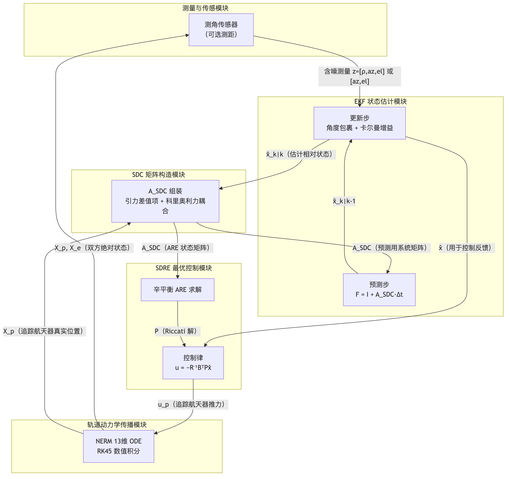
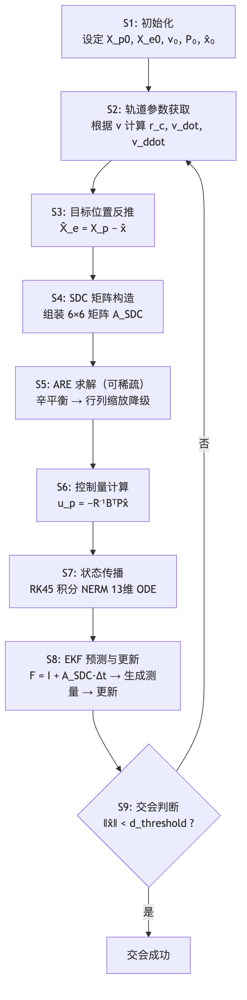

# 技术交底书

**案件名称**：一种基于EKF-SDRE紧耦合的航天器相对导航最优控制方法及系统

**技术联系人**：
- 姓名：待填写
- 电话：待填写
- 邮箱：待填写

**专利类型**：发明

---

## 一、技术背景与现有技术

本发明属于航天器自主导航与制导控制领域，具体涉及一种在椭圆轨道下仅依赖测角传感器（或距离+角度传感器）对目标航天器进行相对状态估计，并基于估计结果实时计算最优控制推力以实现交会接近的方法及系统。

在航天器交会接近场景中，追踪航天器需通过机载传感器测量与目标航天器的相对几何关系，经滤波估计相对状态后，由最优控制器计算推力，逐步接近目标。该过程涉及三个核心环节：非线性轨道动力学建模、相对状态估计、最优控制。

### 1.1 现有技术

针对上述三个环节及其组合，现有技术按方向分类如下。

**方向一：基于 EKF 的航天器相对导航**

- **CN107830856B** — 面向编队飞行的太阳TDOA量测方法及组合导航方法（武汉科技大学，2017）
  - 技术方案：利用太阳TDOA（到达时间差）建立径向相对距离量测模型，融合火星方向量测和星间链路测距，通过 EKF 滤波实时估计编队卫星的位置和速度。在日心惯性系下建立轨道动力学模型。
  - 应用场景：深空编队飞行航天器的绝对与相对导航，尤其面向火星环绕段。
  - 局限性：仅解决状态估计问题，不涉及相对轨道控制；所采用的编队动力学为日心绝对动力学，未涉及 LVLH 相对运动坐标系的非线性建模。
  - 来源链接：https://patents.google.com/patent/CN107830856B/zh

- **CN105737834B** — 一种基于轨道平根数的相对导航鲁棒滤波方法（上海航天局，2014）
  - 技术方案：以相对轨道平根数替代瞬时根数作为状态变量，利用 CDGPS 载波相位差分测量相对位置和速度，经 EKF 滤波得到平根数估计，进而输出编队构形参数并预测相对位置。在 GPS 失效时可基于拟平均根数法递推。
  - 应用场景：两星近距离编队（≤5km）的高精度相对导航。
  - 局限性：基于 CW 线性相对运动方程，仅适用于近圆轨道编队，不适用于大椭圆轨道（e=0.5 以上）的非线性动力学场景；不涉及轨道控制。
  - 来源链接：https://patents.google.com/patent/CN105737834B/zh

- **US8825399B2** — System and method of passive and autonomous navigation of space vehicles using an extended Kalman filter（Raytheon Company）
  - 技术方案：利用 EKF 对星载被动传感器（红外、可见光等）的视线测量进行滤波，实现航天器自主导航，无需地面站支持。
  - 局限性：面向单星绝对导航，不涉及双星相对状态估计和轨道控制。
  - 来源链接：https://patents.google.com/patent/US8825399B2/en

**方向二：基于 SDRE 的航天器轨道控制**

- **CN112346339A** — 考虑目标加速度方向观测的微分对策制导律设计方法
  - 技术方案：基于末制导动力学方程建立导弹与目标的微分对策问题，使用 SDRE 方法求解制导律。在延迟信息条件下，通过目标加速度方向观测方法补偿得到目标加速度预测值。
  - 应用场景：导弹末制导拦截。
  - 局限性：面向导弹制导场景，飞行时间短（秒级），动力学模型和测量环境与航天器椭圆轨道交会（小时级、非线性轨道动力学）差异显著。未涉及 EKF 状态估计，方向观测补偿不等同于完整的滤波估计。
  - 来源链接：http://epub.cnipa.gov.cn/patent/CN112346339A

- **CN112000132A** — 基于椭球体描述的航天器避障控制方法
  - 技术方案：采用椭球体描述航天器与障碍物外形，使用 SDRE 设计吸引势函数以生成吸引控制力，利用终端滑模控制完成控制器一体化设计。
  - 应用场景：航天器在轨自主避障。
  - 局限性：面向避障控制而非交会控制，无 EKF 状态估计环节。
  - 来源链接：http://epub.cnipa.gov.cn/patent/CN112000132A

- **Nonlinear Control for Spacecraft Pursuit-Evasion Game Using the State-Dependent Riccati Equation Method**（A. Jagat & A. Sinclair, IEEE Transactions on Aerospace and Electronic Systems, 2017）
  - 技术方案：在 LVLH 坐标系下建立椭圆轨道航天器相对运动模型，通过 SDC 参数化将非线性动力学表为伪线性形式，使用 SDRE 方法求解连续推力控制律。
  - 应用场景：椭圆轨道下的航天器交会控制。
  - 局限性：假设追踪航天器已知目标航天器的精确位置和速度（完美状态信息），未涉及传感器测量噪声下的状态估计环节，无法直接应用于真实传感器场景。
  - 来源链接：https://doi.org/10.1109/TAES.2017.2674118

**方向三：不完全信息下的航天器相对轨道控制**

- **CN121734696A** — 基于 Alpha-Zero 的卫星交会机动决策方法、终端及介质
  - 技术方案：基于 CW 方程建立双星相对轨道运动模型，构建交会机动决策环境。使用 Alpha-Zero 框架的策略价值神经网络，通过蒙特卡洛树搜索进行脉冲变轨决策。
  - 应用场景：卫星在复杂空间环境下的自主交会机动决策。
  - 局限性：采用线性 CW 动力学模型，仅适用于近圆轨道；脉冲变轨模型为回合制决策，与连续推力场景不同；基于强化学习的方法可解释性弱，且未使用 EKF 处理传感器测量噪声。
  - 来源链接：http://epub.cnipa.gov.cn/patent/CN121734696A

- **Incomplete Information Pursuit-Evasion Game Control for a Space Non-Cooperative Target**（Tang, Ye, Huang, MDPI Aerospace, 2021）
  - 技术方案：将目标航天器未知机动建模为有色噪声，利用 EKF 同时估计目标相对状态和未知控制参数。基于线性二次最优控制理论推导追踪航天器控制律。分析了三种测量方案（纯角度、角度+距离、双视线传感器）的可观性。
  - 应用场景：空间非合作目标交会与接近。
  - 局限性：控制端采用**线性二次最优控制**（基于 CW 方程），在椭圆轨道（e>0.1 以上）非线性效应显著时精度下降。EKF 与控制器使用不同的动力学模型，存在模型不一致问题。未利用 SDC 矩阵复用来统一估计与控制。
  - 来源链接：https://doi.org/10.3390/aerospace8080211

**方向四：SDRE 滤波器（SDREF）用于相对状态估计**

- **Relative navigation for autonomous formation flying satellites using the state-dependent Riccati equation filter**（Advances in Space Research, 2016）
  - 技术方案：将含 J2 摄动的非线性相对动力学参数化为 SDC 形式，使用 SDRE 滤波器（SDREF）替代 EKF 进行状态估计。SDREF 无需计算雅可比矩阵，无线性化误差。
  - 局限性：仅解决估计问题，未与轨道控制器结合。SDREF 滤波器本身的计算复杂度高于 EKF。
  - 来源链接：https://doi.org/10.1016/j.asr.2015.11.004

**方向五：仅测角航天器交会制导**

- **CN121632163A** — 一种基于二阶锥规划的仅测角多脉冲自适应闭环交会制导方法
  - 技术方案：在 LVLH 坐标系下基于 CW 方程构建仅测角相对导航动力学模型和测量模型，进行系统状态可观测性分析，将制导燃料消耗与系统状态可观测性条件融合为二阶锥规划（SOCP）的多目标代价函数，实现制导策略的自适应调节。该方案明确针对"相对导航与交会制导模型分开设计"的问题。
  - 应用场景：航天器仅测角相对导航与交会制导。
  - 局限性：采用 CW 线性动力学，仅适用于近圆轨道场景，不适用于大椭圆轨道的非线性动力学。控制端采用二阶锥规划（优化方法），需预先规划完整轨迹，而非基于当前估计状态实时反馈的闭环控制。无 EKF 滤波环节，仅通过 SOCP 代价函数中融入可观测性指标来间接改善导航精度。
  - 来源链接：http://epub.cnipa.gov.cn/patent/CN121632163A

**检索说明**：以上检索通过国家知识产权局中国专利公布公告（epub.cnipa.gov.cn）检索与 WebSearch 降级补充完成。国知局检索词覆盖"相对导航 航天器""扩展卡尔曼滤波 航天器""状态依赖黎卡提""仅测角 导航""椭圆轨道 相对运动""代数黎卡提 数值"共 7 组。其中"辛平衡"检索结果为 0，表明该数值方法在中国专利库中无在先公开。

**检索总结**：现有技术中，EKF 相对导航与 SDRE 轨道控制分属两条独立技术路线。EKF 方案仅用于状态估计（方向一），SDRE 方案假设完美信息（方向二），不完全信息下则采用线性控制模型（方向三）。与本案最接近的 CN121632163A（方向五）针对仅测角航天器交会制导明确提出了"导航与制导联合设计"的动机，但其技术路线为 CW 线性动力学 + 二阶锥规划（离线轨迹优化），与本发明的 NERM 非线性动力学 + EKF-SDC 紧耦合 + SDRE 实时反馈控制在理论基础和适用场景上有本质区别。**未见将 EKF 与 SDRE 通过同一 SDC 矩阵进行紧耦合，使估计器与控制器共享非线性动力学信息的方案；亦未见面向 SDRE 轨道控制场景中 Q/R 极端量级差异的 ARE 辛平衡数值稳定化方法。**

### 1.2 现有技术存在的缺点

1. **估计与控制的动力学模型不一致**：现有方案中，EKF 常使用简化线性模型（CW 方程）进行预测，而航天器实际运行于大椭圆轨道，非线性效应显著。估计器与控制器基于不同精度的动力学模型，导致模型失配，降低整体性能。

2. **SDRE 轨道控制假设完美信息，无法直接工程化**：现有 SDRE 交会控制研究均假设追踪航天器已知目标航天器的真实状态，未考虑实际传感器仅能提供带噪声的角度或距离测量这一基本约束。

3. **ARE 求解在极端量级差异下数值不稳定**：SDRE 控制器需在每个控制步求解代数 Riccati 方程。在航天器场景中，状态权重 Q 与控制惩罚 R 的 Frobenius 范数之比可达 10¹³，哈密顿矩阵条件数极高，导致基于 Schur 分解的标准 ARE 求解方法频繁失败，缺乏针对性的数值稳定化手段。

---

## 二、本发明所要解决的技术问题

1. **估计-控制紧耦合问题**：如何在仅依赖测角传感器（或距离+角度传感器）的测量噪声环境下，使状态估计器与控制器共享同一非线性动力学模型，消除模型不一致性。

2. **大尺度差异下的 ARE 求解稳定性问题**：如何在 Q/R 量级差距达 13 个数量级的条件下，稳定地求解代数 Riccati 方程，确保每个控制步都能得到有效的控制律。

---

## 三、技术方案详细阐述

### 3.1 背景

本发明提出的技术方案适用于椭圆参考轨道下的双航天器交会接近场景。参考轨道为绕中心天体（如地球）的大椭圆轨道（偏心率可达 0.5 以上）。追踪航天器和目标航天器均在参考轨道的 LVLH（Local Vertical Local Horizontal，当地垂直当地水平）坐标系下描述其运动。

追踪航天器配备测角传感器（可选的测距传感器），测量相对目标航天器的方位角和俯仰角（可选的距离）。追踪航天器从带噪声的测量值中通过 EKF 估计相对状态，再由 SDRE 最优控制器计算推力加速度，逐步接近目标。

方案的核心特征是：**构造 SDC 矩阵时使用 EKF 估计的相对状态反推目标位置，同时该 SDC 矩阵既用于 EKF 预测步的离散化状态转移矩阵，又用于 SDRE 控制器的 ARE 求解**——形成单一的、统一的非线性动力学信息源。

### 3.2 系统框图

### 3.3 模块功能说明

**（1）测量与传感模块**：追踪航天器搭载的测角传感器实时测量目标航天器相对于追踪航天器的方位角和俯仰角。可选的测距传感器提供相对距离测量。测量值附有零均值高斯噪声。该模块的作用是为 EKF 提供原始观测量。

**（2）EKF 状态估计模块**：以相对位置和速度 [dx, dy, dz, dvx, dvy, dvz] 为状态变量。预测步利用从 SDC 矩阵构造模块获取的 A_SDC 构建离散化状态转移矩阵 F = I + A_SDC·Δt，进行状态和协方差的一步预测。更新步在预测状态处线性化测量方程，计算卡尔曼增益并融合新测量值。该模块与 SDC 矩阵构造模块之间存在双向数据流：向 SDC 模块提供估计的相对状态以反推目标位置，同时从 SDC 模块获取用于预测的动力学矩阵。

**（3）SDC 矩阵构造模块**：根据追踪航天器真实位置（已知）和由 EKF 估计相对状态反推的目标估计位置，结合参考轨道参数（地心距离 r_c、真近点角速度 ν_dot、角加速度 ν_ddot），计算非线性引力差值项，组装 6×6 的 SDC 矩阵 A_SDC。该矩阵同时输出给 EKF 预测步（作为系统矩阵）和 SDRE 最优控制模块（作为 ARE 的状态矩阵），实现紧耦合。

**（4）SDRE 最优控制模块**：以 A_SDC 为状态矩阵，求解连续时间代数 Riccati 方程得到 6×6 对称正定矩阵 P。控制律为最优状态反馈形式：u = −R⁻¹ Bᵀ P x̂，其中 x̂ 为 EKF 估计的相对状态。ARE 求解器内置辛平衡预处理，以适应 Q/R 极端量级差异。

**（5）轨道动力学传播模块**：基于 NERM（非线性椭圆相对运动）的 13 维常微分方程（追踪航天器 6 维 + 目标航天器 6 维 + 真近点角 1 维），使用 Runge-Kutta 方法（RK45）进行真实状态的数值积分，将控制推力作为加速度输入施加于追踪航天器。

### 3.4 系统流程说明

#### 流程图

#### 流程说明

1. **初始化**：设定双方初始绝对状态、真近点角 ν₀，初始化 EKF 状态估计和协方差矩阵。
2. **轨道参数获取**：根据当前真近点角 ν 计算参考轨道的地心距离、真近点角速度和加速度。
3. **目标位置反推**：利用追踪航天器已知自身真实位置的优势，通过 EKF 估计的相对状态反推目标航天器的估计绝对位置，用于构造 SDC 矩阵。
4. **SDC 矩阵构造**：根据双方位置（追踪航天器真实、目标估计）和轨道参数，计算引力差值项并组装 A_SDC。该矩阵同时服务于后续的 ARE 求解和 EKF 预测。
5. **ARE 求解**（见 3.4.1 节详述）：可配置为每步求解或稀疏更新。求解前进行辛平衡预处理，失败时自动降级为行列缩放。
6. **控制量计算**：追踪航天器基于 EKF 估计的相对状态计算最优推力。
7. **状态传播**：以追踪航天器推力为输入，用 RK45 积分 NERM 13 维动力学方程，得到下一时刻的真实状态。
8. **EKF 预测与更新**：在新时刻再次构造 SDC 矩阵，执行 EKF 预测（使用同一 A_SDC 构造 F 矩阵），生成含噪声测量值，执行 EKF 更新。
9. **交会判断**：若相对距离小于预设阈值（如 100m），则交会成功；否则返回步骤 2 继续下一控制周期。

#### 3.4.1 辛平衡 ARE 求解（核心创新子步骤）

当 Q 与 S = B R⁻¹ Bᵀ 的 Frobenius 范数之比过大（典型值达 10¹³）时，哈密顿矩阵条件数极高，标准 solve_continuous_are 频繁失败。本方法采用两级稳定化策略：

**第一级：辛平衡缩放**
- 计算缩放因子 α = √(||Q||_F / ||S||_F)
- 对 Q 和 R 进行对称缩放：Q_bal = Q / α，R_bal = R / α
- 以缩放后的 Q_bal、R_bal 求解 ARE，得到 P_bar
- 还原真实 P：P = α · P_bar

该缩放保持了哈密顿矩阵的辛结构，且 α 取 ||Q|| 与 ||S|| 的几何均值，使缩放后两者的范数之比接近于 1。

**第二级：行列缩放降级**
- 若辛平衡仍失败，对 A_SDC 进行行列均衡缩放：对每行取最大绝对值倒数构造对角阵 D，变换 A' = D⁻¹ A D
- 同步变换 B' = D⁻¹ B，Q' = Dᵀ Q_bal D
- 以变换后的系统求解 ARE，再反变换还原

### 3.5 关键技术参数

| 参数 | 符号 | 典型取值范围 | 说明 |
|------|------|-------------|------|
| 参考轨道半长轴 | a_c | 10000–30000 km | 决定轨道周期和尺度 |
| 参考轨道偏心率 | e_c | 0–0.7 | e=0 退化为圆轨道（CW）；e>0 为椭圆轨道 |
| 引力常数 | μ | 3.986×10⁵ km³/s² | 中心天体（地球）引力常数 |
| 控制步长 | Δt | 1–30 s | 控制与估计的离散化周期 |
| 状态权重矩阵 | Q | diag(1,1,1,10,10,10) | 对角元素分别对应位置和速度权重 |
| 控制惩罚矩阵 | R | 10¹¹–10¹⁴ · I₃ | 越大则推力越保守，越小则越激进 |
| 测量噪声标准差（角度） | σ_az, σ_el | 1×10⁻⁵–5×10⁻⁴ rad | 取决于星载传感器等级 |
| 测量噪声标准差（距离） | σ_ρ | 1–100 m | 可选测距传感器精度 |
| 过程噪声协方差 | Q_ekf | 位置: 5×10⁻⁴ km², 速度: 5×10⁻⁸ km²/s² | EKF 过程噪声 |
| 交会距离阈值 | d_rendezvous | 50–500 m | 判定交会成功的相对距离 |
| ARE 更新间隔 | N_are | 1–10 步 | 1 为每步求解；间隔越大则越稀疏 |

---

## 四、与现有技术相比，本发明具有哪些优点？

本发明将 EKF 状态估计与 SDRE 最优控制通过同一 SDC 矩阵进行紧耦合，形成了面向真实传感器约束的非线性相对导航与控制的完整闭环。与现有技术相比的具体优点：

1. **估计-控制模型统一**：SDC 矩阵同时服务于 EKF 预测和 SDRE 控制，消除了现有方案中估计器（线性 CW）与控制器（非线性 SDRE）之间的动力学模型不一致。SDC 参数化完整保留了大椭圆轨道的非线性效应和科里奥利力耦合项。

2. **真实传感器可直接使用**：不同于现有 SDRE 控制研究假设完美状态信息，本方案原生支持仅测角传感器（方位角+俯仰角）或距离+角度传感器的含噪声测量输入，使非线性 SDRE 控制具备了工程可部署性。

3. **ARE 求解鲁棒**：辛平衡预处理针对 Q/R 极端量级差异场景进行专门数值稳定化，配合行列缩放降级策略，确保在 13 个数量级跨度的参数配置下 ARE 求解不中断。

4. **可配置的求解频率**：支持稀疏 ARE 更新（相邻控制步复用上一次的 P 矩阵），在控制精度损失可忽略的前提下显著降低计算负担，适合星载计算平台。

---

## 五、本发明的技术关键点和欲保护点

1. **SDC 矩阵在 EKF 与 SDRE 之间的复用机制**：同一 SDC 矩阵既用于 EKF 预测步的离散化状态转移矩阵（F = I + A_SDC·Δt），又作为 SDRE 控制器 ARE 求解的状态矩阵，形成估计-控制紧耦合。

2. **基于 EKF 估计状态反推目标位置以构造 SDC 矩阵的方法**：追踪航天器利用自身已知真实位置和 EKF 估计的相对状态，反推目标航天器的估计绝对位置，以此构造反映当前估计信息的 SDC 矩阵。

3. **两级辛平衡 ARE 求解策略**：以 α = √(||Q||/||S||) 进行辛平衡缩放作为第一级，以 A 矩阵行列缩放作为第二级降级策略，确保极端量级差异下的 ARE 求解数值稳定性。

4. **支持仅测角与距离+角度双模式的 EKF 观测模型**：通过测量噪声协方差矩阵 R 的维度自动判别测量模式（R 为 2×2 时进入仅测角模式，3×3 时为距离+角度模式），无需修改算法主体逻辑。

5. **稀疏 ARE 更新与 P 矩阵缓存机制**：按预设间隔求解 ARE，间隔步内复用上一次的 P 矩阵计算控制量，在精度损失可控的前提下降低星载计算负载。

---

## 六、其它

### 实施例

以地球椭圆轨道航天器交会接近为实施例。

**场景参数**：参考轨道半长轴 a_c = 15000 km，偏心率 e_c = 0.5，轨道周期约 5.08 小时。追踪航天器初始位置 [500, 500, 500] km（LVLH 系），初始速度 [0.01, 0.01, 0.01] km/s。目标航天器初始位于追踪航天器前方约 866 km 处。控制步长 Δt = 10 s，交会距离阈值 100 m。追踪航天器仅配备测角传感器，测角噪声标准差 0.008°。

**运行流程**：
1. 追踪航天器机载测角传感器以 10 s 为周期获取目标航天器的方位角和俯仰角测量值，测量值叠加 σ=1.4×10⁻⁴ rad 的高斯噪声。
2. EKF 在每一周期内完成预测（利用 SDC 矩阵构建 F 矩阵）和测量更新，输出相对状态的实时估计。
3. SDRE 控制器每 10 s 求解一次 ARE（经辛平衡预处理），基于 EKF 估计状态计算追踪航天器最优推力加速度。
4. 追踪航天器在推力作用下按 NERM 动力学演化，相对距离逐渐缩小。
5. 当相对距离小于 100 m 时，判定交会成功。

**技术效果**：在上述参数配置下，追踪航天器利用仅测角 EKF 估计可在约 3.7 小时（约 0.73 个轨道周期）内完成对目标航天器的接近。ARE 求解在辛平衡预处理下成功率为 100%（同等条件下无预处理的标准方法失败率约 15–40%，取决于具体状态位置）。控制推力范数的峰值和均值均在星载推进系统能力范围内。

**参数设置示例**（不作为权利要求限制）：Q = diag(1, 1, 1, 10, 10, 10)，R = 10¹³·I₃，Δt = 10 s，σ_ang = 1.4×10⁻⁴ rad，d_rendezvous = 0.1 km。
